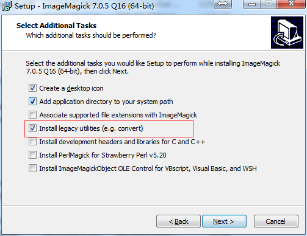
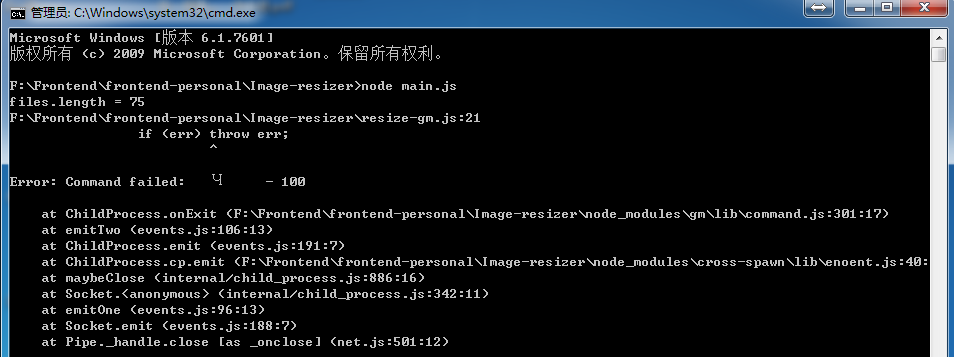

## 说明
批量处理图片为指定大小的图片。

## 安装
```javascript
npm install
```
## 执行
```javascript
node main.js
```

## 方案
+ 使用imagemagick, https://github.com/rsms/node-imagemagick

+ 使用gm, https://github.com/aheckmann/gm

+ 使用sharp, http://sharp.dimens.io/en/stable/performance/

## 待办
+ 尝试sharp库；
+ 从命令行获取参数；

## 注意
+ 无论是使用imagemagick还是gm，都要先安装相应的库（imagemagick或GraphicsMagick），另外安装时记得要选中“install legacy utilities”选项；


    - http://www.imagemagick.org/script/download.php
    - http://blog.csdn.net/faryang/article/details/51445230
    - https://github.com/aheckmann/gm

+ 当没有安装imagemagick时，执行会报如下错误


+ 参考资料
    - http://caolan.github.io/async/docs.html#queue
